# Come investire

In questo documento intendo spiegare la mia strategia di investimento.

## Indice

Questo documento è organizzato come segue:

* <a href="#disclaimer">Un disclaimer iniziale</a>
* <a href="#di-cosa-non-parleremo">Di cosa *non* parleremo</a>
* <a href="#inquadramento">Un inquadramento del rapporto tra te e il mercato</a>
* <a href="#principi">Una serie di principi che seguiremo</a>
* <a href="#cose-da-non-fare">Una serie di cose da *non* fare</a>
* <a href="#dove-investire">Una spiegazione della strategia di investimento che seguiremo</a>
* <a href="#cosa-succede">Una spiegazione di cosa accade ai tuoi soldi quando investi e quando disinvesti</a>
* <a href="#valuta">Una nota sulla valuta</a>
* <a href="#prospettive">Una panoramica sulle possibilità di guadagno/perdita</a>
* <a href="#piattaforma">Indicazioni su quale banca usare per investire</a>
* <a href="#istruzioni">Istruzioni passo passo su come investire</a>
* <a href="#su-quali-indici-investire">Su quali indici investire</a>
* <a href="#altre-osservazioni">Risposte ad alcune domande frequenti (e.g., ma i consulenti?)</a>
* <a href="#matematica">Matematica minima per investire</a>

## <a id="disclaimer"></a>Sono soldi tuoi

I soldi sono tuoi, se segui i miei consigli e perdi tutto, mi spiace, ma non ti rimborserò. Investire è una responsabilità personale di ciascuno.

Questa non è una consulenza finanziaria. Io non sono un professionista. Gli investimenti finanziari non sono la mia fonte primaria di reddito.

In questo documento si fa riferimento soprattutto al canale YouTube di [Ben Felix](https://www.youtube.com/@BenFelixCSI), un consulente finanziario canadese. Il canale è nato nel 2017 fa e fornisce materiale molto ben fatto in cui spiega i capisaldi della finanza personale e mostra i risultati di paper scientifici. È davvero ben fatto. Ben Felix in genere non sponsorizza prodotti specifici. Nulla verrà in tasca a Ben Felix, se seguirete queste indicazioni.

Parleremo anche di specifici titoli, banche e piattaforme di investimento. Nel fornire queste informazioni io non guadagno nulla. Non ci sono referral code o niente di simile.

Non chiedetemi di investire a nome vostro.

## <a id="di-cosa-non-parleremo"></a>Di cosa *non* parleremo

In questo documento parleremo principalmente di come iniziare ad investire sul mercato azionario.

Non parleremo invece di:

* **Mercato obbligazionario o liquidità.** Ha senso dividere il proprio capitale in vari tipi di investimenti. In particolare, per il capitale di cui si prevede di avere bisogno nel breve o medio termine.
  Il mantra per gli investimenti che suggerisco è "investite tutto il denaro di cui potete ragionevolmente fare a meno per *almeno* 10 anni".
  È importante pensare anche a come investire il resto del capitale, ma la cosa *più* importante è investire il prima possibile la parte di cui potete privarvi per un periodo di tempo lungo.
  Molti suggeriscono di avere una strategia di ripartizione del capitale del tip 60% azionario (quello di cui parliamo qui) e 40% obbligazionario. In realtà, a me pare molto arbitrario, e mi sembra più utile porsi una domanda del tipo "nella mia situazione specifica, di quale parte del capitale posso privarmi per 10 anni senza battere ciglio?".
* **Investimento nel mattone.** Investire nel mattone è probabilmente sopravvalutato, ma siamo italiani e ci piace possedere le case in cui abitiamo ([75% in Italia vs 65% della media EU](https://www.statista.com/statistics/246355/home-ownership-rate-in-europe/)).
  Secondo gli studi, stare in affitto e investire tutto il capitale che versereste come acconto nel mercato azionario è più vantaggioso, considerando anche i costi a cui non si pensa subito.

  Approfondimento: [la playlist sul canale di Ben Felix](https://www.youtube.com/playlist?list=PLiOs3-llXq5Ar6DuvqbYopF8hqB8gydva).
* **Il fatto che tu abbia un mutuo.**
  Molto in breve, per quanto controintuitivo, se investite dei soldi mentre avete un mutuo, non è molto differente immaginarsi di essersi fatti prestare dei soldi dalla banca per investirli (invece che per acquistarci la casa).
  Farsi prestare dei soldi per investirli significa investire [*in leva*](https://it.wikipedia.org/wiki/Leva_finanziaria), che è un'operazione rischiosa.
  Se siete disposti a tollerare un rischio del genere, può avere senso *comunque* estinguere il mutuo e aumentare la percentuale di capitale che si investe sul mercato azionario.
  Molto concretamente, ha senso aumentare la parte del vostro risparmio mensile dedicato a ripagare il mutuo più rapidamente a scapito di quella che usate per investire.

  Approfondimento: [Mortgage Debt and Asset Allocation](https://www.youtube.com/watch?v=AKc01jo1qLw).
* **Questioni fiscali**. O meglio ne accenneremo.

  Approfondimento: [Educati e Finanziati Avanzati 02: tassazione degli investimenti finanziari](https://www.youtube.com/watch?v=ZJy4y_vkj28)


## <a id="inquadramento"></a>Inquadramento del rapporto tra te e il mercato

* **Tu sei l'ultima ruota del carro.**
  Se stai leggendo questo documento non sei un investitore professionista, non ti informi tutti i giorni, non ti arrivano indiscrezioni utili per investire.
* **Quando investi, non ci sono pasti gratis.**
  A seguito del punto precedente, possiamo dire che tu non hai alcun modo di fare grossi guadagni in tempi rapidi in maniera affidabile, ripetibile e senza costi ingenti.
  L'unico pasto gratis è diversificare. Quello non costa niente e migliora le tue prospettive, ne parleremo.
* Dati i punti precedenti, **il tuo rapporto con il mercato può essere riassunto come segue**: tu dai al mercato del capitale di cui puoi privarti per un tempo significativo (10+ anni), ti assumi del rischio di perderlo (in parte o anche interamente) e ti assumi lo stress di tollerare le oscillazioni (anche molto ampie) che il tuo capitale avrà durante il periodo di investimento; in cambio, il mercato, nella gran parte dei casi, ti ripagherà con un premium significativo.
  Più gli dai capitale, più tempo glielo lasci e più sei disposto a tollerare oscillazione, più, nella gran parte dei casi, il mercato ti darà indietro. Tutto qui.
* **In genere, sul lungo periodo, il mercato globale cresce.**
  L'obiettivo è qui molto poco ambizioso: cercare di portare a casa quella crescita sul lungo periodo.
  Non c'è nessuna ambizione di fare più di così.
  Qui cerchiamo di farlo in maniera semplice ed efficiente, ovvero tenendo i costi di gestione bassi.


## <a id="principi"></a>I principi

### <a id="principio-1"></a>1. Investi solo in ciò che comprendi a fondo

In questo documento cercherò di spiegare a fondo una strategia di investimento semplice. Non si parlerà di alcuno strumento finanziario complesso.

### <a id="principio-2"></a>2. Non crederti furbo

Ricordati che sei l'ultima ruota del carro, l'unica cosa che hai in mano sono il tuo capitale, il tempo e la tua tolleranza al rischio.

### <a id="principio-3"></a>3. Diversifica quanto più possibile

Diversificare riduce il rischio di eventi estremi su un singolo titolo/mercato.
La strategia proposta in questo documento mira a diversificare quanto più possibile. L'idea è di comprare strumenti finanziari che coprano la percentuale più ampia possibile del mercato globale. Come se diventassimo soci di tutte le aziende in questi mercati.

### <a id="principio-4"></a>4. Tieni i costi bassi

Sul lungo periodo, risparmi apparentemente piccoli sui costi di investire, si trasformano in grandi guadagni.
Questo accade perché, se reinvesti i guadagni fatti, sei soggetto all'[*interesse composto*](#interesse-composto). Questo significa che a fronte di risparmi piccoli in percentuale, sul lungo periodo, si possono avere grossi guadagni.
Consideriamo ad esempio, due titoli uguali, ma uno costa 3.00% annuo e l'altro 0.10% annuo. Assumiamo che il rendimento escludendo i costi sia del 7.50%.
Il primo (più costoso), in 20 anni vi restituirà un capitalle 2.4 volte l'originale.
Il secondo (meno costoso), in 20 anni vi restituirà un capitalle 4.6 volte l'originale.
Una differenza molto significativa. I due esempi di costi di gestione sono abbastanza estremi (tra i più costosi e tra i meno costosi), ma realistici.

### <a id="principio-5"></a>5. Decidi un orizzonte dell'investimento e non guardarlo più fino alla fine

La strategia qui descritta è estremamente semplice ma richiede disciplina. Ovvero, non vendere anche quando le cose vanno male. Un buon modo per evitare di farlo è *non* controllare gli investimenti ogni giorno.
L'idea di dover "curare attivamente" il proprio investimento, di farci manutenzione è quantomeno fuorviante. Gli aggiustamenti hanno dei costi e sono spessissimo dettati da una percezione di emergenza e dall'impulsività.
Qui la nostra strategia è investire sul lungo periodo (10+ anni) e prepararci psicologicamente a tollerare le, anche *molto* ampie, oscillazioni che il nostro investimento attraverserà in questo periodo. Armatevi di disciplina o lasciate perdere.

### <a id="principio-6"></a>6. Dedica il tuo (poco) tempo a investire saggiamente la parte più ampia del tuo capitale

Investire può anche essere divertente e puoi anche decidere di dedicare una piccola parte del tuo capitale a fare investimenti rischiosi (i cosiddetti *fun money*). Per me, questo è come giocare d'azzardo, ma ci sta. Però, è importante non permettere che questa cosa catturi la maggior parte dell'attenzione che dedichi ai tuoi investimenti.
Insomma, prima di andare al casinò con 100 EUR, assicurati di aver investito bene il resto dei tuoi risparmi.

Vedi il concetto di [costo opportunità](https://it.wikipedia.org/wiki/Costo_opportunit%C3%A0).

### <a id="principio-7"></a>7. Investire oggi è meglio che investire domani

I tuoi soldi fermi sul conto corrente non mantengono il loro valore, ma lo perdono per via dell'inflazione, ovvero la perdita del potere d'acquisto del denaro.
Anche investendo si subisce l'inflazione, ma è importante capire che lasciare i soldi liquidi sul conto non "preserva" il capitale, il capitale liquido perde potere d'acquisto per via dell'inflazione.
Inoltre, investire presto è importante perché, se hai un investimento con un rendimento positivo e reinvesti i guadagni, sei soggetto all'[*interesse composto*](#interesse-composto).

Approfondimento: [% di inflazione annua in Italia negli ultimi anni](https://ec.europa.eu/eurostat/databrowser/bookmark/f9b5859a-4785-4507-a033-24d0c8fb134e?lang=en&createdAt=2025-09-03T20:08:43Z).

Un corollario di questo principio è che, una volta determinato quanto volete investire, la cosa migliore da fare è *investirlo tutto oggi*, evitando ad esempio piani di accumulo (dove si investe automaticamente una cifra lungo un certo lasso di tempo).

Approfondimento: [Dollar Cost Averaging vs. Lump Sum Investing](https://www.youtube.com/watch?v=KwR3nxojS0g).

Se è il primo investimento investire una grossa cifra in un colpo solo può intimorire, ricordiamoci quindi che questo è un corollario e che il principio fondamentale è evitare di procrastinare indefinitamente iniziare ad investire.
Il meglio sarebbe iniziare *oggi*, ma se è troppo per te, meglio investire lungo l'arco dei prossimi due mesi con un piano d'accumulo, piuttosto che tra 2 anni.

## <a id="cose-da-non-fare"></a>Cose da non fare

### Non comprare titoli individuali
Molto rischioso. Il fatto che un'azienda sia famosa, abbia una lunga vita o sia molto profittevole, non garantisce che il valore delle sue azioni cresca indefinitamente.
Soprattutto, è importante capire che il prezzo di un'azione non rappresenta il "valore" dell'azienda, ma semplicemente il punto di incontro tra chi vuole acquistare e chi vuole vendere quel titolo.
Questo significa che il prezzo un'azione *include le aspettative nei confronti di quell'azienda date le informazioni pubblicamente disponibili oggi*.
Un'azienda sana e profittevole (e.g., Apple) potrebbe essere un cattivo investimento perché c'è troppo entusiasmo attorno ad essa e quindi, pur essendo un'ottima azienda, il suo prezzo è così gonfio che è difficile salga ancora.
Più brevemente, son bravi tutti a investire su aziende che tutti sanno che van bene, è poco probabile tu faccia grandi ricavi lì. Vedi il [Principio #2 - Non crederti furbo](#principio-2).
Non dico di non comprare titoli individuali, ma occhio al [Principio #6: Dedica il tuo (poco) tempo a investire saggiamente la parte più ampia del tuo capitale](#principio-6).

Approfondimento: [Picking Stocks](https://www.youtube.com/watch?v=AecvTErBQY8).

### Non comprare cose "di moda"

Strumenti finanziari sulla canapa, sulle rinnovabili, sullo spazio o altro sono da evitare.
Meglio diversificare maggiormente ([Principio #3: Diversifica quanto più possibile](#principio-3)) e soprattutto, ora che qualcosa di profittevole viene ad avere uno strumento finanziario dedicato la fase d'oro è già passata. Non credetevi furbi ([Principio #2](#principio-2)).

Approfondimento: [Thematic ETFs (are Terrible Investments)](https://www.youtube.com/watch?v=dwPh-PAg9A8).

### Non fare day trading, ovvero comprare e vendere spesso

Palese violazione del [Principio #5: Decidi un orizzonte dell’investimento e non guardarlo più fino alla fine](#principio-5). Inoltre, ogni operazione costa ([Principio #4: Tieni i costi bassi](#principio-4)), rischi di cadere in dinamiche psicologiche analoghe al gioco d'azzardo ([Principio #6: Dedica il tuo (poco) tempo a investire saggiamente la parte più ampia del tuo capitale](#principio-6)) e probabilmente ti stai credendo furbo ([Principio #2](#principio-2)).

Approfondimento: [The Truth About Day Trading](https://www.youtube.com/watch?v=qhHOmZVAqBE).

### Non cercare di "entrare nel mercato al momento giusto"

Tipicamente finisci solo per procrastinare iniziare ad investire.
Non crederti furbo ([Principio #2](#principio-2)). Qui il nostro orizzonte temporale è di lungo termine, facciamo leva su quello.

Approfondimento: [Does Market Timing Ever Work?](https://www.youtube.com/watch?v=w_aOERmUWdA)

Anche cercare di entrare nel mercato "pian piano", ovvero investendo piccole cifre ogni mese ha in media risultati peggiori che investire oggi tutto quello che intendi investire sul mercato di riferimento ([Principio #7: Investire oggi è meglio che investire domani](#principio-7)).
Per quanto investire piccole somme alla volta possa essere psicologicamente benefico e aiutare ad iniziare ad investire, dal punto di vista dei dati, non è la cosa più razionale da fare.

Approfondimento: [Dollar Cost Averaging vs. Lump Sum Investing](https://www.youtube.com/watch?v=KwR3nxojS0g)

### Non usare fondi gestiti in maniera attiva

I consulenti finanziari spesso propongono fondi gestiti in maniera attiva, ovvero dietro ai quali c'è un team di persone che decide cosa mettere nel fondo e cosa no.

Tipicamente questi fondi sono costosi ([Principio #4: tieni i costi bassi](#principio-4)), ed scientificamente provato che, in media, il costo extra che ci si assume non vale la pena.

L'alternativa ovvia ai fondi gestiti sono degli strumenti finanziari come gli ETF, la cui composizione è determinata non da persone con conoscenze speciali, ma semplicemente prendendo acriticamente azioni di aziende che rispettano un certo criterio.

Ad esempio, esistono ETF che sono composti dalle 500 più grandi aziende del mercato statunintense ([S&P 500](https://it.wikipedia.org/wiki/S%26P_500)). Chi gestisce il fondo compra e vende in base a chi entra o esce dalla classifica.
Questi strumenti tipicamente hanno dei costi molto contenuti.

Approfondimento: [la playlist su YouTube di Ben Felix che perora la causa *contro* i fondi gestiti attivamente](https://www.youtube.com/playlist?list=PLiOs3-llXq5BvEAMqHlhW4wOyZEpPH5B1).

## <a id="dove-investire"></a>Dove investire

Qui io suggerisco di investire nel mercato azionario tutto il capitale di cui potete privarvi per *almeno* 10 anni. [Più avanti](#prospettive) riportiamo in dettaglio lo spettro di possibili esiti e la probabilità associata.
Lo strumento finanziario qui scelto sono gli ETF, che sono strumenti a gestione passiva tipicamente molto poco costosi ([Principio #4](#principio-4)).

Gli ETF che consideriamo qui sono molto diversificati ([Principio #3](#principio-3)).
Infatti, parleremo principalmente di ETF che seguono l'indice MSCI World, che diversifica quanto più possibile sui mercati "sviluppati" (in breve, l'Occidente più il Giappone), investendo in aziende medio/grandi.
Più avanti discuteremo anche di come coprire le aziende "piccole" e i mercati cosiddetti "emergenti", che includono ad esempio la Cina.

MSCI ([Morgan Stanley Capital International](https://it.wikipedia.org/wiki/MSCI)) è un'azienda che fa indici. In questo caso, per indice intendiamo sostanzialmente una lista di aziende che rientrano nella descrizione del particolare indice.

Ad esempio, l'indice MSCI World è descritto come segue nel suo [factsheet](https://www.msci.com/documents/10199/178e6643-6ae6-47b9-82be-e1fc565ededb):

> The MSCI World Index captures large and mid-cap representation across 23 Developed Markets (DM) countries. With 1,320 constituents, the index covers approximately 85% of the free float-adjusted market capitalization in each country.

In pratica è una lista di 1320 aziende di dimensione medio-grande in 23 mercati sviluppati. Non tutte le aziende sono equamente rappresentate: un'azienda è più o meno rappresentata nell'indice a seconda della dimensione dell'azienda, ovvero, grandi aziende compongono una percentuale più rilevante dell'indice.

Ad oggi è composto da aziende provenienti dai seguenti paesi: USA (72%), Giappone (5.5%), Regno Unito (3.64%), Canada (3.27%), Francia (2.66%) e altri (12.81%).

L'obiettivo dell'indice è quello di permetterti di essere esposto (nel bene e nel male) all'85% del capitale in cui è tecnicamente possibile investire in quei paesi (escludendo, ad esempio, quote riservate ai governi).

Ora, non è possibile "comprare un indice", puoi però comprare un ETF ([exchange-traded fund](https://en.wikipedia.org/wiki/Exchange-traded_fund)) che si basa su quell'indice, ovvero che lo replica.

Consideriamo ad esempio l'ETF seguente:

```
Nome: UBS Core MSCI World UCITS ETF USD acc
ISIN: IE00BD4TXV59
```

Analizziamo il suo nome:

* è un *ETF*;
* emesso da *UBS*, una [banca svizzera](https://it.wikipedia.org/wiki/UBS);
* *Core* è il nome commerciale della linea di ETF offerti da UBS;
* traccia l'indice *MSCI World* di cui parlavamo prima;
* *UCITS* significa che è un titolo "armonizzato" secondo [la normativa europea omonima](https://en.wikipedia.org/wiki/Undertakings_for_Collective_Investment_in_Transferable_Securities_Directive_2009), che impone alcune regole;
* è in dollari americani (*USD*, di questo parleremo meglio [più avanti](#valuta));
* segue una politica di reinvestimento dei titoli che offrono divendi (*acc*); in pratica, invece che distribuirvi i dividendi, li reinveste.

L'ISIN è il codice univoco dell'ETF. Potete usarlo per trovare informazioni rapidamente su quell'ETF senza confodervi con altri con nomi molto simili.
`IE` all'inizio del codice ISIN ci indica che il fondo ha sede in Irlanda.

Esistono vari siti utili per trovare informazioni più specifiche su un ETF (ad esempio i costi), Borsa Italiana, Trackinsight e justETF:

* [`IE00BD4TXV59` su Borsa Italiana](https://www.borsaitaliana.it/borsa/etf/scheda/IE00BD4TXV59.html);
* [`IE00BD4TXV59` su justETF](https://www.justetf.com/en/etf-profile.html?isin=IE00BD4TXV59);
* [`IE00BD4TXV59` su Trackinsight](https://www.trackinsight.com/en/fund/UETW).

Questi siti sono solo informativi, non sono per comprare/vendere titoli. Il primo offre informazioni accurate per l'Italia (ad esempio sui costi, che possono differire da paese a paese), mentre gli altri sono più approfonditi e sono comodi per effettuare ricerche.

Da questi siti possiamo ottenere alcune informazioni importanti sul titolo. Ad esempio il TER, ovvero il costo di gestione annuo. Per il titolo sopra è 0.10%, molto basso.
Si possono poi vedere altre informazioni come la sede del fondo (Irlanda), il numero di titoli che contiene (attualmente 1321, simile all'indice a cui fa riferimento, MSCI World), l'andamento, la dimensione, la data di nascita e così via.

Si trova anche il link al [factsheet](https://api.fundinfo.com/document/9b9c43cb82e55da457682de1c2e307db_156096/MR_DE_en_IE00BD4TXV59_YES_2025-07-31.pdf) che contiene altre informazioni ma soprattutto una breve spiegazione di cosa fa l'ETF:

> * The fund generally invests in stocks contained in the MSCI World Index. The relative weightings of the companies correspond to their weightings in the index.
> * The investment objective is to replicate the price and return performance of the MSCI World Index net of fees. The stock exchange price may differ from the net asset value.
> * The fund is passively managed.

In breve, come ci aspettavamo, il fondo emula l'indice MSCI World ed è gestito passivamente, ovvero non c'è una persona a decidere cosa metterci, ma semplicemente emula pedantemente l'indice MSCI World.
La gestione passiva è di solito associata a costi di gestione molto bassi ([Principio #4](#principio-4)).

Un altro documento importante che troviamo è il KID (Key Information Document), ma di quello parleremo [più avanti](#istruzioni).

## <a id="cosa-succede"></a>Comprendere costa stai facendo

Tu disponi alla tua banca di acquistare un ETF.
I soldi non saranno più nella tua disponibilità, né di quella della tua banca. In caso la banca fallisse, quei soldi sono salvi (anche se in Italia sei [tutelato fino a 100 000 EUR per banca](https://economiapertutti.bancaditalia.it/aree-tematiche/conto-corrente/il-fondo-interbancario-di-tutela-dei-depositi/index.html)).
I soldi vengono trasferiti a chi gestisce l'ETF, nel caso sopra, in Irlanda, che comprerà con essi le quote delle aziende di cui il fondo è composto al prezzo del giorno dell'acquisto.

Nel tempo, la composizione delle aziende dell'ETF varierà. Quindi le azioni di alcune aziende verranno vendute, le azioni di altre acquistate.
La proporzione che un ETF contiene di ciascuna azienda può anche evolvere nel tempo.

È importante comprendere questo aspetto: la composizione di un ETF varia nel tempo, in base alla variazione dell'indice a cui fa riferimento.
Ad esempio, se un'azienda non rientra più nei criteri di dimensione per stare nell'indice MSCI World, le quote in vostro possesso tramite l'ETF verranno vendute e verrano acquisite quote di altre aziende.

Oltre alla composizione, anche *il valore* delle azioni di un'azienda individuale varieranno, salendo e scendendo.

In ogni istante di tempo, l'andamento dell'ETF è determinato dalla variazione della media pesata del valore delle azioni che contiene l'ETF oggi rispetto al giorno in cui l'avete acquistato. Se è maggiore, vendendo realizzereste del guadagno. Se è minore, vendendo realizzereste una perdita.

Per quanto riguarda i costi, chi vi offre un ETF, ogni anno prenderà una certa percentuale del capitale investito. Questi sono i *costi di gestione*, anche noti come TER. Ad esempio, come dicevamo, l'ETF di cui sopra prende lo 0.10% del capitale ogni anno.
Questi costi vanno tenuti bassi ([Principio #2](#principio-2)).

La tassazione sugli ETF invece funziona come segue: non pagate alcuna tassa fino a quando non vendete il titolo. Il giorno della vendita, si calcola quanto avete guadagnato o perso.
Se avete guadagnato, ovvero avete realizzato una *plusvalenza*, un parte di questi guadagni andranno in tasse.
Se avete perso, ovvero avete realizzato una *minusvalenza*, guadagnerete un "credito" fiscale che potete usare per compensare la tassazione di altri titoli su cui invece avete fatto dei profitti. Questi crediti sono utilizzabili nell'anno in cui effettuate la vendita e nei 4 anni successivi, dopodiché scadono.

> [!WARNING]
> **Nota**: in Italia la tassazione degli ETF ha una importante stortura: la tassazione delle plusvalenze *non* può essere compensata. Tuttavia, i crediti ottenuti da minusvalenze per aver venduto ETF in perdita sono però usabili con *altri* strumenti finanziari (non ETF).
>
> In Italia, la questione del "credito" fiscale è complessa, mutevole, ricca di scadenze e di storture. Qui non approfondiamo.
>
> Approfondimento: [Educati e Finanziati Avanzati 02: tassazione degli investimenti finanziari](https://www.youtube.com/watch?v=ZJy4y_vkj28) di Paolo Coletti, in particolare a [30' 31"](https://youtu.be/ZJy4y_vkj28?t=1831) si parla della stortura dellas tassazione degli ETF. Alla fine del video si accenna ad una proposta di correggere questa stortura ma, ad oggi, non mi risulta sia stata corretta.

In Italia, la tasazione per i titoli è al 26%. Se si investe in titoli di stato europei (come BTP italiani o Bund tedeschi) la tassazione è invece al 12.5%, ma qui non parliamo di titoli di stato.

### <a id="valuta"></a>In che valuta devo investire?

Gli ETF di cui parleremo qui sono in dollari americani (USD).
Investire in dollari americani, aggiunge un rischio: non solo state acquistando azioni di aziende che possono andare bene o male, ma vi state anche esponendo alle fluttuazioni del cambio euro-dollaro americano.

Sul lungo periodo (e in questo documento consideriamo solamente investimenti di lungo periodo) investire in una valuta o in un'altra non fa molta differenza, le oscillazioni, sul lungo periodo, "si compensano" di solito.

Tuttavia, il rischio del cambio aumenta la volatilità del vostro investimento, che è comunque una questione da considerare.

Esiste uno strumento per proteggersi dal rischio del cambio, ovvero acquistare un ETF che si definisce "hedged" rispetto ad una certa valuta. Questi strumenti sono brevemente discussi in una [sezione apposita](#hedging).

Approfondimento: [Should You Currency Hedge Your Portfolio?](https://www.youtube.com/watch?v=K3flJjh00gA)


### <a id="prospettive"></a>Va bene, in pratica, quanto posso aspettarmi di guadagnare?

Sono contento che tu lo abbia chiesto! È una domanda importante a cui però non c'è una risposta univoca. Ciononostante, cercherò qui di mostrarti dei dati precisi su quello che puoi aspettarti considerando come sono andate le cose in passato.

Chiaramente nulla garantisce che quello che è successo in passato si ripeterà uguale ma, nell'impossibilità di prevedere il futuro, questa è la risposta migliore che ci si può dare.

Inutile dire che la domanda corretta dovrebbe essere "quanto posso aspettarmi di guadagnare *o perdere*?". Come vedremo tra poco, investire, anche sul lungo periodo, non da garanzia di non andare in perdita. Ma guardiamo i dati e cerchiamo di approciare la cosa con razionalità.

Di seguito, fissato un titolo (ad esempio quello sopra, `UBS Core MSCI World UCITS ETF USD acc`) e fissato un periodo di investimento (ad esempio 10 anni), guarderemo, secondo i dati storici, qual è la *distribuzione di probabilità* di avere un certo risultato.

Questo significa che riporterò dei grafici che sull'asse X (asse orizzontale) avrà dei rendimenti annui (ad esempio -5% o +10%) e sull'asse Y (asse verticale) avrà la *probabilità* di avere quell'esito.

Ad esempio, se sul grafico, la curva è alta attorno al +5%, bassa attorno al +10% e va 0 sul è +20%, significherà che, secondo i dati storici, ci sono alte probabilità, su 10 anni, di avere rendimenti medi annui attorno al +5%, più basse di averle attorno al +10% e molto scarse di averle al +20%.

> [!CAUTION]
> **Nota**. Ripeto: nei dati sotto l'asse X non rappresenta il tempo e l'Y il valore del titolo. Se non avete capite cosa rappresenta, rileggete qui sopra.

Questi dati sono calcolati misurando tutte le possibili ipotesi di date di acquisto e di vendita che siano a distanza di 10 anni. Ad esempio, ho ipotizzato di comprare il 12 marzo 2010 e di vendere il 12 marzo 2020, poi il 13 marzo, poi il 14 marzo e così via, considerando tutti i dati disponibili.

Il risultato mostrato non considera solo il nudo rendimento del titolo, ma anche altri due fattori: il cambio Euro-dollaro americano e l'inflazione in Italia.
Quindi, se il titolo di cui parliamo è denominato in dollari americani, la simulazione di rendimento terrà conto anche della variazione nel cambio Euro-dollaro nel periodo considerato (che può essere stato d'aiuto o d'ostacolo).
Inoltre, i dati sono anche normalizzati all'inflazione. Ovvero, se il vostro investimento in 10 anni raddoppia il capitale ma l'inflazione ha dimezzato il potere d'acquisto dell'Euro, il rendimento che consideremo per quel periodo sarà nullo.
In un certo senso, i dati che riportiamo ci dicono "quante *pagnotte* in più potrò comprarmi con il capitale che ho ora tra 10 anni?".

I dati *non* considerano invece la tassazione (26%) e i costi di gestione (che variano a seconda dell'ETF scelto, nell'ordine del 0.10%).

> [!CAUTION]
> **Attenzione**: da qui in poi, in questa sezione, si discuterà di mie "ricerche originali", ovvero dati raccolti da fonti ufficiali ma elaborati da me. Mentre quanto detto finora è grossomodo "stato dell'arte ben noto", i dati di seguito riportati sono il frutto di mie elaborazioni ([qui il risultato delle elaborazioni](https://aleclearmind.github.io/investing), [qui il codice](https://github.com/aleclearmind/investing)).
> Sebbene io abbia effettuato diversi controlli manuali, non posso garantire la totale correttezza dei dati riportati di seguito, né me ne assumo la responsabilità nei vostri confronti.
>
> Ciò detto, sappiate che io faccio le mie valutazioni sul mio patrimonio personale assumendo che questi dati siano corretti.

Bene, cominciamo, il grafico seguente riporta i risultati dell'indice MSCI World, su un periodo di investimento di 10 anni (corretto per cambio e inflazione), considerando tutto il periodo da quando esiste l'Euro a oggi, ovvero dal 1999.

> [!TIP]
> **Nota**: le immagini sono cliccabili e ti portano allo strumento che ho usato per produrre il grafico.

[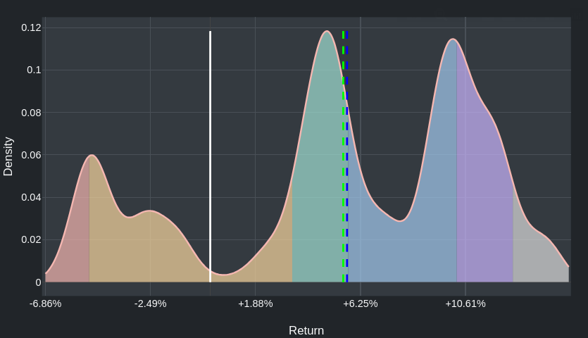
](https://aleclearmind.github.io/investing/#/investing/view/msci-world-index-990100?combo=hold-10.0%2Fyears-max&ac=1&ai=1&s=0%2Ctrue&xmin=-7&xmax=15)

Proviamo a leggere il grafico:

* La linea bianca verticale denota +0%, ovvero nessun guadagno né perdita.
* Ci sono tre picchi, uno bassino a -4.96% (perdita di 40% del capitale in 10 anni), uno altino a +4.79% (+59% del capitale in 10 anni), un altro altino a +10.10% (+160% del capitale in 10 anni), ma questo ci è utile fin lì.
* Proviamo a leggere i colori sotto la curva, da sinistra.
    * Rosso: peggiore 5% dei casi.
    * Ocra: tra il peggior 5% dei casi e il peggior 25% dei casi (quindi 20% dei casi).
    * Verde acqua: tra il peggior 25% dei casi e la mediana (quindi 25% dei casi).
    * Azzurrino: tra la mediana e il miglior 25% dei casi (quindi 25% dei casi).
    * Violetto: tra il miglior 25% dei casi e il miglior 5% dei casi (quindi 20% dei casi).
    * Grigetto: il miglior 5% dei casi.
* Nel 75% dei casi si ha un rendimento annuo *superiore* a +3.41% (+39% del capitale in 10 anni).
  Nel restante 25% dei casi ha un rendimento peggiore, che nel 5% dei casi arriva ad un risultato peggiore di -4.96% annuo (perdita di 40% del capitale in 10 anni).
  Media (linea verde tratteggiata) e mediana (linea blu tratteggiata) sono vicine, sul +5.56% annuo (+71% del capitale in 10 anni).

Riguardatevi bene questi numeri e considerate se siete disposti ad incorrere in questo tipo di esiti dopo 10 anni di investimento.
Per quale porzione del vostro capitale vi sentite di correre questo rischio?
Per la restante parte del vostro capitale si possono fare investimenti meno aggressivi di cui qui non parliamo (ad esempio, obbligazioni).

> [!TIP]
> **Confronto con l'investimento nullo**.
>
> Se i dati sopra vi hanno spaventato, ricordatevi che i dati riportati sono normalizzati all'inflazione.
> Questo significa che il "caso base" (quello in cui non si investe) non è +0% annuo, ma subire l'inflazione.
>
> Consideriamo quindi la distribuzione di probabilità dell'*investimento nullo*, ovvero di tenere i soldi fermi sul conto in Euro:
>
> [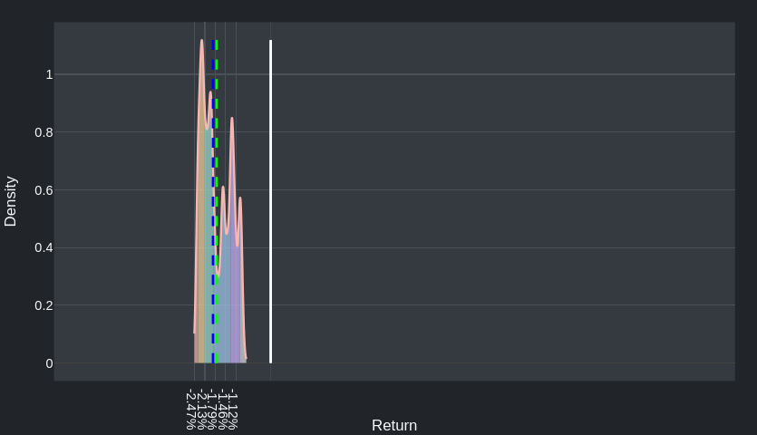
](https://aleclearmind.github.io/investing/#/investing/view/null?combo=hold-10.0%2Fyears-max&ac=0&ai=1&s=0%2Ctrue&xmin=-7&xmax=15)
>
> Come si può vedere, la mediana è in questo caso al -1.86% annuo (perdita del 17% del capitale in 10 anni). Si noti anche come il 100% degli esiti sono di perdita in questo caso (la barretta bianca è 0% di guadagno).
> Chiaramente, esistono degli investimenti "di mezzo" tra tenere i liquidi sul conto e mettere i soldi sul mercato azionario (ad esempio le obbligazioni).
> Però qui la domanda è: per quale porzione del vostro capitale siete disposti ad avere un profilo di rischio come quello sopra?
<!--

Procediamo.
Di seguito riporto nuovamente il primo grafico e di seguito la versione *non* corretta al cambio Euro-dollaro americano, che dovrebbe rispecchiare qualcosa di più simile all'andamento di un ETF hedged.

Correggendo il cambio (come prima):

[
](https://aleclearmind.github.io/investing/#/investing/view/msci-world-index-990100?combo=hold-10.0%2Fyears-max&ac=1&ai=1&s=0%2Ctrue&xmin=-7&xmax=15)

Senza correggere il cambio (caso hedged):

[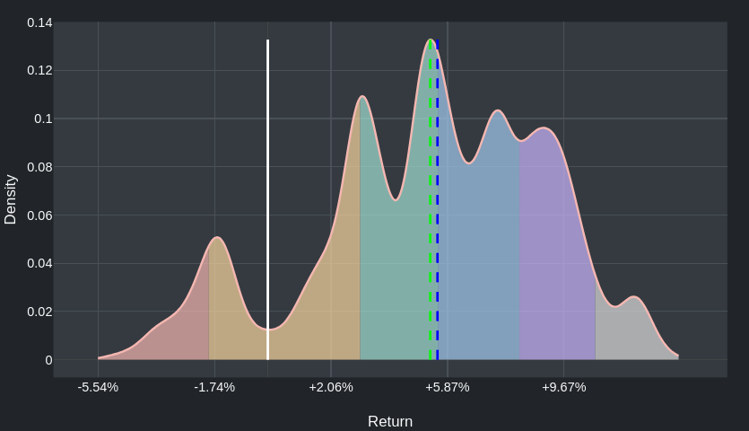
](https://aleclearmind.github.io/investing/#/investing/view/msci-world-index-990100?combo=hold-10.0%2Fyears-max&ac=0&ai=1&s=0%2Ctrue&xmin=-7&xmax=15)

La mediana è simile, ma i casi peggiori sono significativamente meno gravi.

Considerate però che, se limitiamo i dati storici agli ultimi 20 anni, che comunque includono gravi crisi come quella del 2008, la discrepanza è molto meno accentuata.

Correggendo per il cambio:

[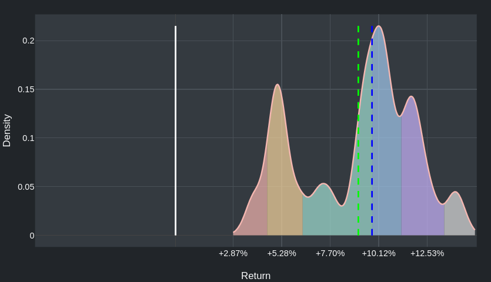
](https://aleclearmind.github.io/investing/#/investing/view/msci-world-index-990100?combo=hold-10.0%2Fyears-20&ac=1&ai=1&s=0%2Ctrue&xmin=-7&xmax=15)

Senza correggere per il cambio (caso hedged):

[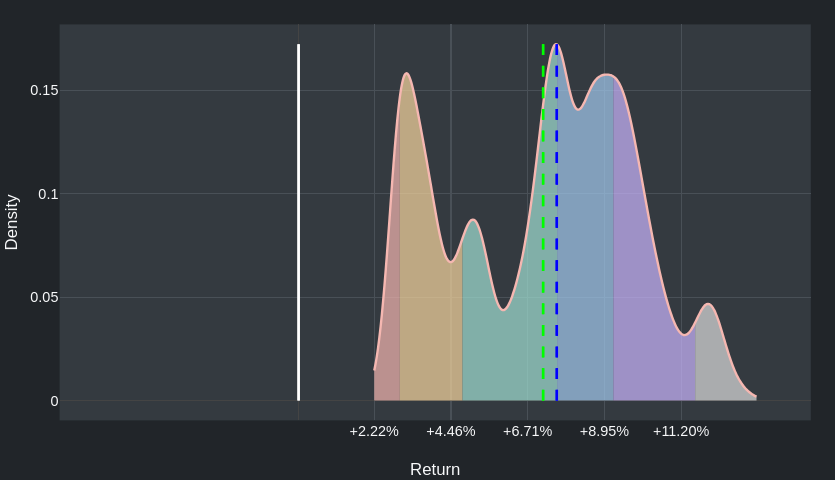
](https://aleclearmind.github.io/investing/#/investing/view/msci-world-index-990100?combo=hold-10.0%2Fyears-20&ac=0&ai=1&s=0%2Ctrue&xmin=-7&xmax=15)

Anzi, in questo caso sarebbe stato decisamente meglio investire senza hedging.

-->

Possiamo concludere che:

<!-- 
2. ha senso fare un po' hedged e un po' no;
-->

1. non ci sono risposte definitive;
2. nella gran parte dei casi le cose vanno piuttosto bene;
3. bisogna comunque essere pronti a subire perdite, anche gravi.

### <a id="piattaforma"></a>Quale piattaforma devo usare per investire?

Puoi investire tramite il tuo consulente o magari la tua banca ha una sezione dell'home banking dedicate agli investimenti dove puoi fare le cose da solo.

Una cosa a cui stare molto attenti sono i costi ([Principio #4](#principio-4)) che la banca ti fa pagare per ogni operazione di investimento: quei costi *vanno a sommarsi* ai costi di gestione di cui abbiamo parlato finora.

Questi costi di solito sono fissi (non proporzionali a quanto si investe) e possono apparire piccoli, ma in realtà, soprattutto se non si investono grandi cifre, possono diventare anche più significativi dei costi di gestione, il che è una cosa da evitare assolutamente ([Principio #4](#principio-4)).

A volte le banche offrono alcuni ETF "in promozione", ovvero senza costi extra rispetto a quelli di gestione del fondo. Ad esempio [Fineco lo fa](https://it.finecobank.com/trading/etf/etf-zero-commissioni/) ([lista completa dei fondi in promozione](https://images.fineco.it/cms/mail/immagini/docs/2022_Promo_ETF/PromoETFZeroCommissioni_Lista.pdf), fino al 30 giugno 2026). L'ETF MSCI World riportato prima, che è uno dei meno costosi tra quelli che si riferiscono a quell'indice, non è oggi in promozione su Fineco. Vi sono però altri ETF che seguono MSCI World in promozione.

Per evitare di essere limitati nelle scelte da fare, la cosa più semplice è aprire un conto su [Trade Republic](https://traderepublic.com/), che ha in pratica zero costi un po' su tutti i fronti, soprattutto negli investimenti. Aprire un conto è relativamente semplice (si può fare solo dall'applicazione) e non costa nulla.
L'unico costo che ho visto finora è 1 EUR per vendere un titolo.

Trade Republic è una [banca tedesca](https://it.wikipedia.org/wiki/Trade_Republic). Il loro obiettivo non è tanto essere una banca "completa" (ad esempio non puoi pagarci gli F24) ma bensì costare pochissimo ed essere la vostra banca secondaria che non usate tanto per le operazioni quotidiane ma per gli investimenti.
È comunque possibile avere delle carte per prelevare e spendere.

Aprire un conto Trade Republic vi darà un IBAN italiano.
In passato Trade Republic introduceva delle complessità per pagare le tasse, ma ad oggi non è più così, sarete nel cosiddetto "regime amministrato" in cui le tasse vengono pagate automaticamente e non dovete occuparvi di nulla.
Insomma, il fatto che sia una banca tedesca non è particolarmente problematico.

Il mio suggerimento è:

1. aprite un conto Trade Republic;
2. fate un bonifico dal vostro conto "classico" a quello su Trade Republic;
3. iniziate ad investire.

> [!TIP]
>
> **Interessi sul conto corrente con Trade Republic**.
>
> Trade Republic ha (solitamente) una politica di passarvi gli interessi stabiliti dalla Banca Centrale Europea sul vostro conto corrente (ovvero sui soldi liquidi che non avete investito). La gran parte delle banche italiane non lo fa. Oltre a Trade Republic, BBVA (una [banca spagnola](https://it.wikipedia.org/wiki/Banco_Bilbao_Vizcaya_Argentaria)) e pochi altri lo fanno.
>
> Altre banche hanno in genere il concetto di "conto deposito" per cui vi garantiscono un rendimento in cambio di vincolare quei soldi per un certo periodo, ovvero introducendo delle penali se li prelevate prima della fine del periodo stabilito.
>
> Attualmente l'interesse stabilito dalla BCE è del 2% annuo, ma questo interesse è soggetto a cambiare. Questo interesse *non è* un investimento o un'alternativa ad investire sul lungo periodo. È solo una cosa in più.

> [!WARNING]
> **Note**: l'assistenza di Trade Republic era nota per essere pressoché inesistente. Tuttavia, hanno recentemente introdotto un servizio telefonico 24/7 con un umano che risponde.
> Non ho ancora avuto modo di provarlo, ma è un ottimo segno.

## <a id="istruzioni"></a>Istruzioni precise su cosa e come investire

> [!CAUTION]
> **Non saltate direttamente a questa sezione!**
>
> Assumetevi la responsabilità delle vostre scelte, riflettete, approfondite, usate il vosto senso critico e solo se alla fine siete convinti, per semplicità, seguite le istruzioni in questa sezione.
>
> Ricordatevi che questo non è una consulenza finanziaria professionale, ma solo una raccolta di riflessioni mie personali e una descrizione di come io investo.
>
> Soprattutto, se doveste perderci, non venite da me. Con tutta probabilità, sarò nella vostra stessa situazione.

Assumendo abbiate aperto un conto su Trade Republic e abbiate trasferito (anche pochi) soldi, di seguito riporto come acquistare un titolo tramite [il sito web di Trade Republic](https://traderepublic.com), potete fare lo stesso dall'app.

1. Nella barra di ricerca inserire l'ISIN (e.g., `IE00BD4TXV59`).
   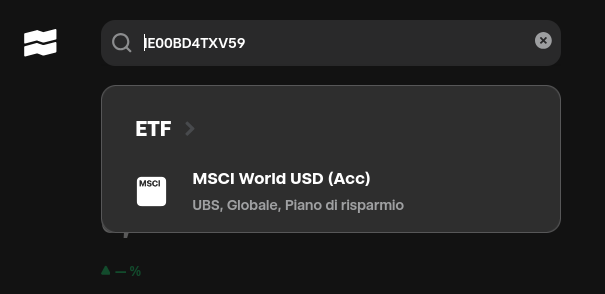

2. Verificare che sia il fondo in cui si intende investire e scaricare il KID (Key Information Document).
   Ad esempio, qui si trova il [KID per l'Italia di `IE00BD4TXV59`](https://api.fundinfo.com/document/0d03def07b964774abf6bbf4ab714e82_91587/PRP_IT_it_IE00BD4TXV59_YES_2025-06-26.pdf?apiKey=9f6e5504-9db4-4483-abd4-ed09993888c1).
   Trade Republic riporta il TER (il costo) ma a volte è errato (si riferisce ad un acquirente tedesco invece che italiano). Vedete nel KID il costo di gestione del fondo.
   Per il fondo di cui sopra, ad oggi, Trade Republic riporta un TER dello 0.06%, mentre per l'Italia (come si vede nel KID e su [Borsa Italiana sotto "Commissioni totali annue"](https://www.borsaitaliana.it/borsa/etf/scheda/IE00BD4TXV59.html)) è dello 0.10%.
   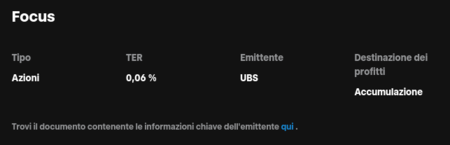

3. **Leggete il KID**. È un documento breve, trasparente e accessibile, regolamentato dalla [normativa europea MiFID 2](https://en.wikipedia.org/wiki/Markets_in_Financial_Instruments_Directive_2014).
   Si tratta dell'ultima barriera di difesa che le istituzioni pongono tra voi e il fare investimenti che non comprendete a fondo e che magari vi portano ad assumervi dei rischi che non vi aspettavate.
   Se non lo leggete, non venite poi a dire "eh ma io non sapevo".
4. Se siete convinti, comprate.

   Potete comprare un certo ammontare qui ed ora (ammesso che i mercati siano aperti) *oppure* potete fare un piano di accumulo (in inglese *savings plan*).

   Sarebbe consigliabile comprare i titoli che vi interessano in una singola transazione.
   Tuttavia, per ragioni prevalentemente psicologiche, per iniziare, può avere senso acquistare poco a poco lungo un certo periodo di tempo.
   Di nuovo, meglio investire tutto in una singola transazione, ma se siete timorosi e volete mediare un po' il prezzo, potete acquistare a poco a poco, lungo l'arco di qualche settimana/mese.
   Vi invito a prendere la decisione che fa sì che voi arriviate ad investire la quota del vostro capitale che avete deciso. In questo caso, l'obiettivo principale non è minimizzare i costi o massimizzare la possibilità di guadagno, ma *non procrastinare* ([Principio #7: Investire oggi è meglio che investire domani](#principio-7)).

   > [!TIP]
   > **Nota**: il piano di accumulo non acquista immediatamente il titolo, ma nelle date che sceglieremo. Potete provare a crearlo e poi cancellarlo subito dopo, senza alcun costo.

   Facciamo quindi un piano di accumulo:

   

5. Selezioniamo ogni quanto acquistare, ad esempio settimanalmente

   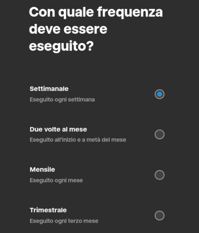
6. Selezioniamo quindi la data di inizio:

   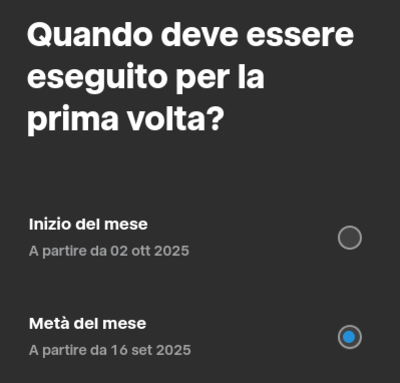

6. Inseriamo quanto intendiamo investire *settimanalmente*:

   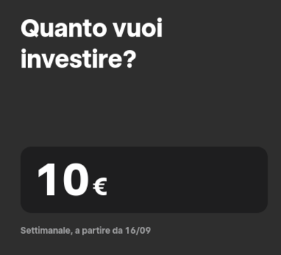

7. Arriviamo al passo di conferma.

   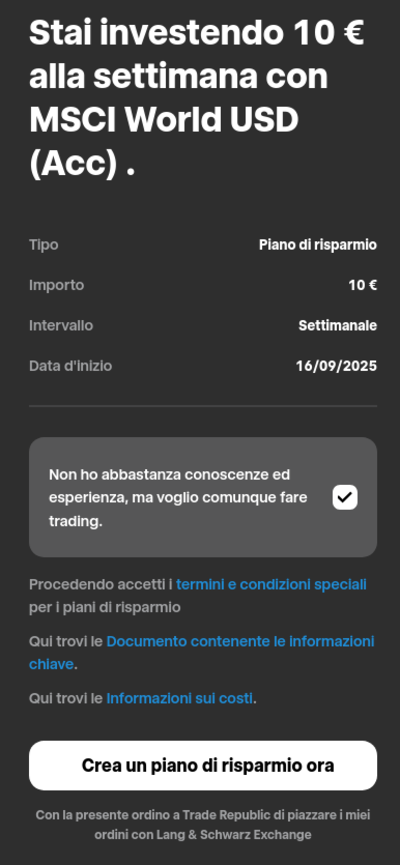
   Analizziamo le varie cose che vediamo:
    1. > Non ho abbastanza conoscenze ed esperienza, ma voglio comunque fare trading

       Questa casella è un requisito di notifica dettato dalla [normativa europea MiFID 2](https://en.wikipedia.org/wiki/Markets_in_Financial_Instruments_Directive_2014) per effettuare operazioni senza l'intermediazione di un consulente finanziario, altresì nota come un'operazione di *mera esecuzione* (in inglese, *execution only*).
       In sostanza, se avete appena aperto un conto, la banca non ha sufficienti dati per valutare se l'operazione che state per eseguire è "appropriata".
       Come dicono le [risposte alle domande frequenti di Trade Republic](https://support.traderepublic.com/en-lv/848-Why-am-I-asked-about-my-trading-knowledge-and-experience-when-placing-an-order), è possibile che questo messaggio sparirà man mano che usate il vostro conto.
       In breve, è un messaggio di avviso per voi e un modo per la banca per non avere reponsabilità legali.

       Facendo un'acquisto dall'app, questa dicitura non viene riportata e si dice invece:
       
       > We don't check for your knowledge when trading non-complex products.

       Approfondimento: ["Orientamenti su alcuni aspetti dei requisiti di appropriatezza e mera esecuzione o ricezione di ordini ai sensi della MiFID II"](https://www.esma.europa.eu/sites/default/files/library/esma35-43-3006_gls_on_certain_aspects_of_the_mifid_ii_appropriateness_and_execution-only_requirements_it.pdf), pubblicato da European Securities and Markets Authority (ESMA).
    2. > Termini e condizioni speciali per i piani di risparmio

       Condizioni per il piano di accumulo.
       Ad ora non posso scaricarlo per via di un errore e dopo aver effettuato l'acquisto, il documento non appare nella sezione documenti "Dati legali > Documenti attuali", dove ci sono tutti gli altri.
    3. > Documento contenente le informazioni chiave

       Il KID, come visto prima.
    4. > Informazioni sui costi

       Non me lo mostra dal sito web, ma dall'app mostra un sommario dei costi di gestione, che si riferiscono però allo 0.6% invece che all'0.10%.
       Se effettuate l'acquisto, ci sarà però un documento in cui i costi sono invece riportati in maniera corretta (0.10%).
    4. > Con la presente ordino a Trade Republic di piazzare i miei ordini con Lang & Schwarz Exchange.

       L'exchange dove verranno piazzati i vostri ordini, parte della [Borsa di Amburgo](https://en.wikipedia.org/wiki/Hamburg_Stock_Exchange).
9. Confermare.

Se lo desiderate, potete ora cancellare il piano d'acquisto dalla sezione "Ordini":

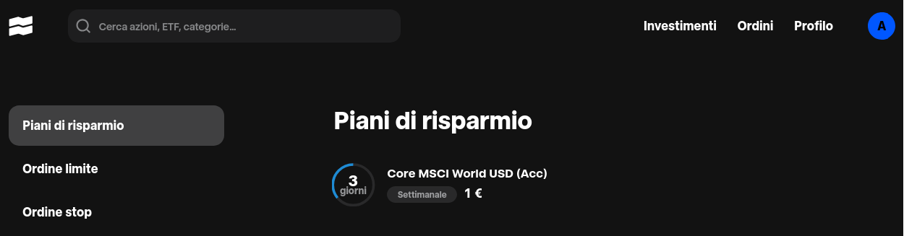

## <a id="su-quali-indice-investire"></a>Su quali indici investire

La strategia che qui vi propongo è di investire in quanta più parte possibile del mercato globale.

In particolare considereremo:

* MSCI World, la "baseline".
  Cattura il ~76% del mercato globale.
* MSCI ACWI, simile a MSCI World ma che include i mercati in via di sviluppo.
  Cattura l'~85% del mercato globale.
* MSCI Small Cap, che include aziende a bassa capitalizzazione nei mercati sviluppati, escluse dai due indici precedenti.
  Catturai il 12.6% dei mercato globale.

Di seguito riporto la distribuzione di probabilità del ritorno sull'investimento di alcuni di questi indici che ho individuato come particolarmente interessanti. Tutti i dati sono normalizzati all'inflazione italiana e al cambio Euro-dollaro americano. Tutti i dati riportati in seguito sono basati sui dati degli ultimi *25 anni* e assumono un investimento di 10 anni. Al contrario di prima, l'area di visualizzazione dei grafici è fissata uguale per tutti tra -6% e +18%.

Riporto prima di tutto, come metro di confronto, l'andamento di MSCI World.

> [!NOTE]
> **Nota**: come sempre le immagini sono cliccabili e portano alla fonte del grafico, dalla quale è anche possibile andare sulla pagina ufficiale dell'indice e vederne i dettagli.

**MSCI World**

[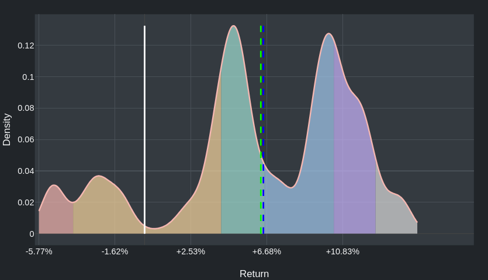](https://aleclearmind.github.io/investing/#/investing/view/msci-world-index-990100?combo=hold-10.0%2Fyears-25&ac=1&ai=1&s=0%2Ctrue&xmin=-6&xmax=18)

**MSCI ACWI World**

[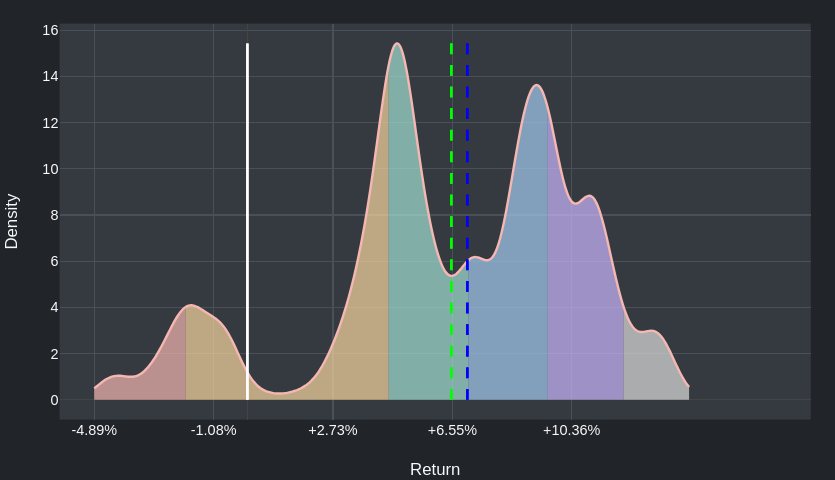](https://aleclearmind.github.io/investing/#/investing/view/msci-acwi-index-892400?combo=hold-10.0%2Fyears-25&ac=1&ai=1&s=0%2Ctrue&es=0%2Ctrue&xmin=-6&xmax=18)

**MSCI World Small Cap Index**

[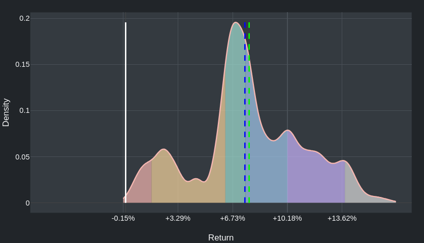](https://aleclearmind.github.io/investing/#/investing/view/msci-world-small-cap-index-106230?combo=hold-10.0%2Fyears-25&ac=1&ai=1&s=0%2Ctrue&xmin=-6&xmax=18)

### ETF interessanti

Di seguito riporto degli ETF che permettono di investire sugli indici indicati sopra.

* `IE00BFY0GT14` di [SPDR](https://en.wikipedia.org/wiki/SPDR), segue **MSCI World Index**, TER 0.12%.
  Ulteriori informazioni: [Borsa Italiana](https://www.borsaitaliana.it/borsa/etf/scheda/IE00BFY0GT14.html), [TrackInsight](https://www.trackinsight.com/en/fund/XDWD), [JustETF](https://www.justetf.com/en/etf-profile.html?isin=IE00BFY0GT14).
* `IE00B44Z5B48` di [SPDR](https://en.wikipedia.org/wiki/SPDR), segue **MSCI ACWI Index**, TER 0.12%.
  Ulteriori informazioni: [Borsa Italiana](https://www.borsaitaliana.it/borsa/etf/scheda/IE00B44Z5B48.html), [TrackInsight](https://www.trackinsight.com/en/fund/XFRA:SPYY), [JustETF](https://www.justetf.com/en/etf-profile.html?isin=IE00B44Z5B48).
* `IE00BF4RFH31` di [iShares](https://en.wikipedia.org/wiki/IShares), segue **MSCI World Small Cap Index**, TER 0.35%.
  Ulteriori informazioni: [Borsa Italiana](https://www.borsaitaliana.it/borsa/etf/scheda/IE00BF4RFH31.html), [TrackInsight](https://www.trackinsight.com/en/fund/WLDS), [JustETF](https://www.justetf.com/en/etf-profile.html?isin=IE00BF4RFH31).
  
In pratica il mio suggerimento è di investire l'87% del capitale (di cui potete privarvi per almeno 10 anni) su `IE00B44Z5B48`, che segue l'indice MSCI ACWI, e il rimanente 13% su `IE00BF4RFH31`, che segue l'indice MSCI World Small Cap.

Tutti questi ETF sono acquistabili tramite TradeRepublic.

Se siete interessati a strategie di investimento un filo più sofisticate, leggete la parte su [investire a fattori](INVESTIRE-A-FATTORI.md).

## <a id="altre-osservazioni"></a>Altre osservazioni

### Ma i dividendi?

In breve, sono fumo negli occhi.
Prendete titoli che reinvestono automaticamente i dividendi.

Approfondimento: [The Irrelevance of Dividends](https://www.youtube.com/watch?v=f5j9v9dfinQ).

### Il problema con i consulenti finanziari

> Ma il mio consulente finanziario...

I consulenti finanziari nella gran parte dei casi sono l'apparato commerciale degli strumenti finanziari che ti propongono.

Tipicamente ai consulenti vanno parte delle commissioni di gestione dei titoli che acquisti. Quindi loro hanno interesse che 1) tu investa quanta più parte del tuo capitale e 2) che tu investa in strumenti costosi. Il costo spesso va di pari passo con la complessità dello strumento.

Gli ETF di cui sopra sono semplicissimi e costano molto poco.
Talvolta i consulenti ti dicono direttamente "ah no io non tratto gli ETF perché non ci guadagno niente".

Ora, io immagino che, se questo documento vi convince, voi vi armerete di buona volontà e andrete dal vostro consulente, con cui magari avete un rapporto di fiducia, e gli direte "io voglio comprare questo!".
Può darsi che cerchi di dissuadervi, ma, più probabilmente, vi "concederà" di farlo. Ovvero, vi dirà "sì, investiamo un po' di soldi in questo", ma il suo obiettivo principale è tenervi soddisfatti e al contempo assicurarsi che invece voi continuiate a investire nei prodotti che vi offre lui.

Il mio obiettivo è invece qui convincervi che questa deve essere la vostra *unica* strategia di investimento (sul mercato azionario). I soldi sono vostri, non dovete chiedere il permesso al consulente per decidere come investirli.

Avete poco tempo per seguire i vostri investimenti ([Principio #6: Dedica il tuo (poco) tempo a investire saggiamente la parte più ampia del tuo capitale](#principio-6)). Tenete una gestione del vostro risparmio semplice e che potete comprendere al 100% ([Principio #1: Investi solo in ciò che comprendi a fondo](#principio-1)).

Il consulente finanziario ad un certo punto probabilmente cercherà anche di dirvi "sì, tutto quello che vuoi, ma guarda qui che guadagni ho fatto fare a questo altro mio cliente" e vi mostrerà dei dati episodici. Non vi mostrerà quando le cose sono andate male. Non darà alcuna prova per sostenere di essere in grado di battere il mercato globale ripetibilmente. Ignorate queste affermazioni.

Il consulente finanziario può essere un grosso ostacolo ad implementare questa strategia di investimento.

Quello che io consiglio è semplicemente di disinvestire quello che avete, trasferirlo con un semplice bonifico su un conto di Trade Republic, acquistare i titoli sopra e dimenticarvene. Si fa molto rapidamente.

### Eh ma ho degli investimenti in perdita che devo recuperare, non posso disinvestire

Sbagliato! Quando si parla di investimenti, in ogni istante di tempo, bisogna ignorare integralmente quello che è successo in passato e cambiare la propria politica di investimento in quello che si ritiene *in questo istante* la cosa migliore da fare.

Questo non vuol dire violare il [Principio #5](#principio-5) (Decidi un orizzonte dell’investimento e non guardarlo più fino alla fine) e cambiare spesso la propria strategia di investimento. Significa semplicemente che, se questo documento vi convince, bisogna ignorare qualsiasi cosa sia successa nel passato e passare immediatamente alla strategia di investimento che oggi pensate sia quella corretta.

Approfondimento: [Fallacia dei costi affondati (o irrecuperabili)](https://it.wikipedia.org/wiki/Costo_irrecuperabile).

Cercare di recuperare i soldi persi in un investimento andato male è di per sé assurdo. Se esistesse un modo per guadagnare di più, perché non farlo prima comunque? E comunque non vi è ragione di cercare di recuperare la perdita con lo stesso strumento finanziario che ve l'ha fatta realizzare, potete usarne un altro.

Esiste in realtà un'eccezione a questo ragionamento, in cui ciò che è successo nel passato ha senso che influisca sulle vostre scelte di oggi, ovvero le minusvalenze. Le minusvalenze sono crediti fiscali (ovvero dei "buoni sconto" sulle tasse) che guadagnate quando realizzate una perdita, ovvero quando vendete un titolo ad un valore inferiore rispetto a quello a cui lo avete acquistato.
La ragione per cui lo stato vi concede questi bonus è che, al contrario, quando vendete un titolo ad un valore più alto di quello di acquisto, lui siete un pezzo del guadagno, quindi ha senso fare il contrario quando ci perdete.

Tuttavia, il discorso sulle minusvalenze in Italia è complesso, nel senso che spesso non potete usare i crediti fiscali guadagnati con uno strumento finanziario per compensare tassazione di un altro (o magari non avete proprio il credito fiscale). Per cui, non affronterò oltre questo argomento.

### Sovraesposizione al mercato in cui si lavora

Se siete un professionista di un qualche ambito (informatico, sanitario, energetico), potreste essere tentati di investire in ambiti di cui siete esperti.

Non solo sconsiglio di farlo ([Principio #2: Non crederti furbo](#principio-2)) ma in realtà avrebbe senso fare l'esatto opposto, ovvero *ridurre* la propria esposizione da un settore sul quale siete già esposti lavorativamente.

Immaginate di essere un informatico e che ci sia una bolla nel vostro settore che vi porta a perdere il lavoro.
Sareste contenti di vedere allo stesso tempo i vostri investimenti andare male? Probabilmente no.

In ogni caso, per semplicità, io suggerisco di non fare nulla di tutto ciò e investire il più diversificato possibile, senza aumentare o diminuire la propria esposizione nel settore di cui si è esperti.


### E se viene la guerra?

Approfondimento: [Stocks, Bonds, and War](https://www.youtube.com/watch?v=RsDKBDPXK7M).
Comunque la guerra non ci sarà in tutto il mondo, per cui diversificare aiuta ([Principio #3: Diversifica quanto più possibile](#principio-3)).

### Ma io ho `$QUESTIONE_ETICA`, non voglio investire in `$X`!

Capisco. Controllare per questo genere di cose per una strategia di investimento che mira a diversificare quanto più possibile mantenendo le cose semplici non è molto compatibile con remore di tipo etico.

Guardate la lista dei titoli di cui è composto l'ETF e valutate voi.
In generale, state investendo sul "progresso economico dell'Occidente nel suo insieme".

### <a id="hedging"></a>Voglio progettermi dalle fluttuazioni EUR-USD

In caso si desideri proteggersi dal rischio del cambio, è possibile acquistare ETF "hedged".
In italiano si dice che un titolo ha "coperatura valutaria".

Ad esempio, se investite in dollari americani ma la valuta con cui fate (e farete) acquisti è l'Euro, è possibile prendere un ETF EUR-hedged.
In pratica, state acquistando un'assicurazione che modererà, ma non annullerà, gli effetti negativi di periodi di cambio a voi sfavorevole e, viceversa, annullerà gli effetti positivi di periodi di cambio favorole.
Questa assicurazione ha un costo, infatti tipicamente gli ETF hedged sono più costosi (attenzione al [Principio #4](#principio-4)). Questi costi costi sono in parte fattorizzati nel costo dell'ETF e in parte no, nel senso che gli strumenti finanziari sottostanti per proteggervi dalla volatilità del cambio non sono perfetti e tipicamente peggiorano la performance del titolo rispetto alla sua versione non-hedged.

Esiste una versione dell'ETF di UBS di cui abbiamo parlato sopra che traccia l'indice MSCI World che è EUR-hedged, ovvero ammortizza le oscillazioni dovute al cambio USD-EUR.

```
UBS Core MSCI World UCITS ETF hEUR acc
ISIN: IE000TB15RC6
```

La dicitura *hEUR* significa che è hedged rispetto all'Euro, appunto.

Ulteriori dettagli su [justETF](https://www.justetf.com/en/etf-profile.html?isin=IE000TB15RC6), [TrackInsight](https://www.trackinsight.com/en/fund/BCFI) e [Borsa Italiana](https://www.borsaitaliana.it/borsa/etf/scheda/IE000TB15RC6.html).

Come si può vedere e come ci potevamo aspettare, questo ETF ha un costo più alto, 0.13% invece che 0.10%.

In pratica, la strategia qui presentata prevede di *non* investire in ETF hedged.
Alla fine sono degli strumenti finanziari più complessi che hanno dei costi (o meglio, delle inefficienze) difficili da misurare e che per questo preferisco evitare.


## <a id="matematica"></a>Un po' di matematica

### Le percentuali

Per sapere quant'è il X% del vostro capitale Y:

$$Y\times\frac{X}{100}$$

Ad esempio il 5% di 1000 EUR è

$$1000\times\frac{5}{100}=50$$

### <a id="interesse-composto"></a>Calcolare l'interesse composto

Se un titolo vi da un rendimento del X% annuo, in Y anni il rendimento sarà:

$$\left(\left(1+\frac{X}{100}\right)^{Y}-1\right)\times 100$$

Ad esempio su un titolo vi da il 5% di rendimento annuo per 10 anni:

$$
\left(\left(1+\frac{5}{100}\right)^{10}-1\right)\times 100=\\
\left({1.05}^{10}-1\right)\times 100=\\
\left(1.63-1\right)\times 100=\\
0.63\times 100=\\
63
$$

Ovvero +63%.

Per confronto, se invece investite il vostro capitale *senza reinvestire i guadagni*, assumendo lo stesso rendimento e periodo di investimento di prima avrete semplicemente $X\times{}Y=5\times10=50$, ovvero +50% del capitale originale.
