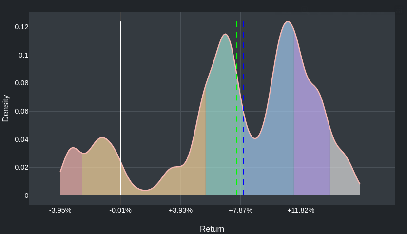
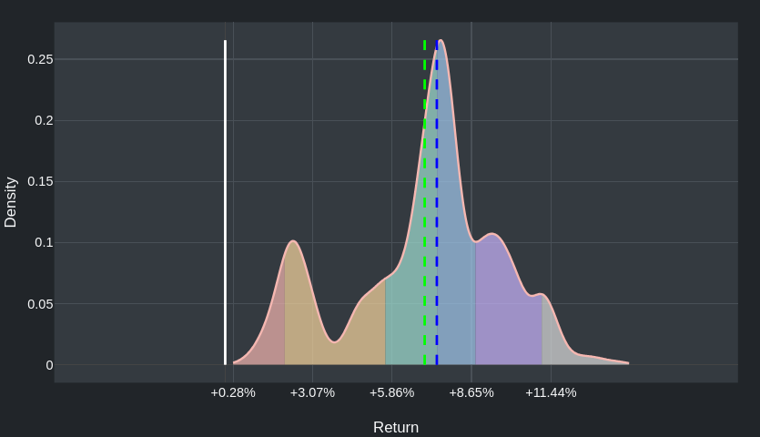
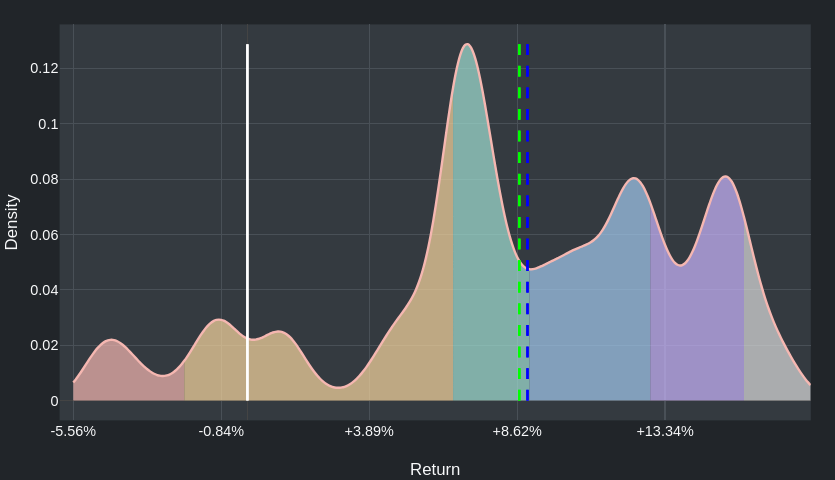
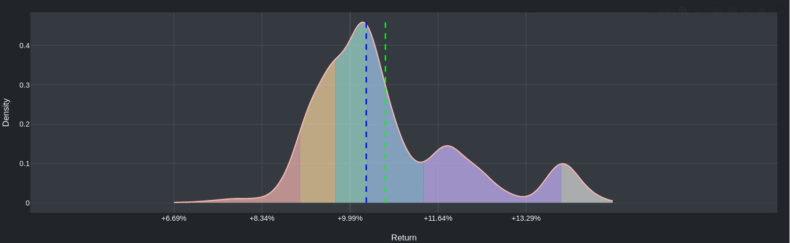
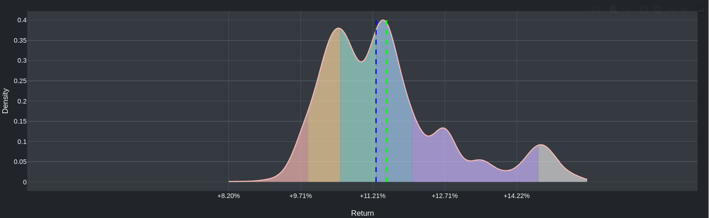
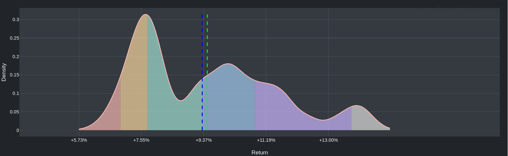
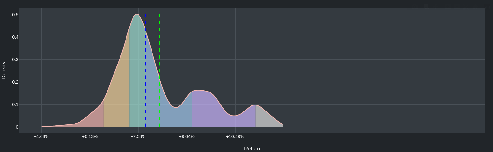
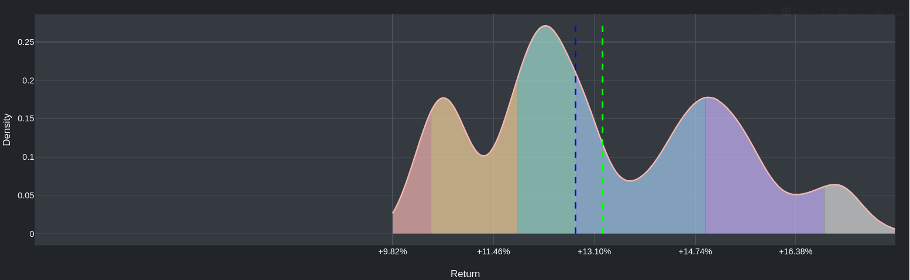
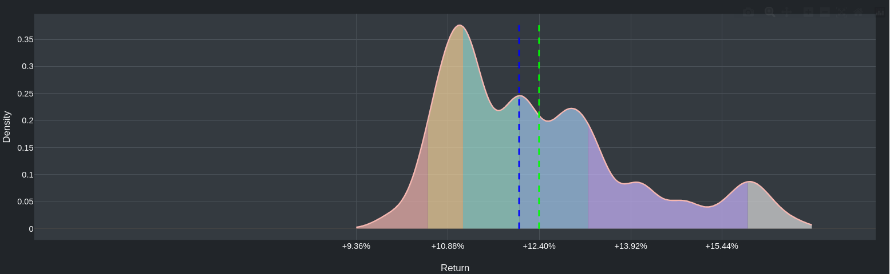

# Investire "a fattori"

Di seguito riporto alcuni titoli che ritengo interessanti.
In particolare, useremo sempre degli ETF piuttosto diversificati e a basso costo, ma seguendo la strategia di investimento "a fattori" (o [*factor investing*](https://en.wikipedia.org/wiki/Factor_investing)), noto anche come "il modello a 5 fattori Fama-French" ([Eugene Fama](https://en.wikipedia.org/wiki/Eugene_F._Fama) e [Kenneth French](https://en.wikipedia.org/wiki/Kenneth_French) sono gli autori del modell). Ne esistono varianti.

Approfondimento: [Five Factor Investing with ETFs](https://www.youtube.com/watch?v=jKWbW7Wgm0w).

Vediamo alcuni fattori.

[**Valore**](https://en.wikipedia.org/wiki/Value_investing) (Value): titoli "sottoprezzati". Si tratta sostanzialmente di comprare un titolo che ha perso valore, analizzando alcune sue caratteristiche di bilancio che indicano che il mercato ha reagito in maniera eccessivamente negativa ad un qualche evento e che i fondamentali dell'azienda sono invece buoni.

**Dimensione** (Small Cap): titoli di aziende non-medio/grandi, che sono ad esempio escluse dall'indice MSCI World di cui abbiamo parlato prima.

[**Momentum**](https://en.wikipedia.org/wiki/Momentum_(finance)): investire in titoli il cui valore sta crescendo, disinvestire i titoli il cui valore sta diminuendo.

[**Qualità** o **redditività**](https://en.wikipedia.org/wiki/Quality_investing) (Quality): aziende i cui bilanci indicano un'azienda di ottimo qualità, ad esempio i profitti.

La cosa importante è che questi fattori possono essere calcolati in maniera sistematica, non fanno affidamento all'expertise di un gestore di un fondo attivo (che sono costosi). Quindi, pur essendo uno strumento leggermente più sofisticato di quelli visti finora, rispettano il [Principio #4](#principio-4). I costi saranno comunque leggermente più alti dei titoli visti finora (tipicamente 0.25% annuo).

Esistono degli indici, ad esempio forniti da MSCI, e degli ETF che li seguono, che permettono di investire in questi fattori.

Di seguito riporto la distribuzione di probabilità del ritorno sull'investimento di alcuni di questi indici che ho individuato come particolarmente interessanti. Tutti i dati sono normalizzati all'inflazione italiana e al cambio Euro-dollaro americano. Tutti i dati riportati in seguito sono basati sui dati degli ultimi *25 anni* e assumono un investimento di 10 anni. Al contrario di prima, l'area di visualizzazione dei grafici è fissata uguale per tutti tra -6% e +18%.

Riporto prima di tutto, come metro di confronto, l'andamento di MSCI World.

> [!NOTE]
> **Nota**: come sempre le immagini sono cliccabili e portano alla fonte del grafico, dalla quale è anche possibile andare sulla pagina ufficiale dell'indice e vederne i dettagli.

**MSCI World**

**MSCI ACWI World**

ACWI significa "All Country World Index", in pratica è come MSCI World, ma include anche i mercati emergenti, non solo quelli sviluppati.

**MSCI World Sector Neutral Quality Index**

**MSCI World Small Cap Index**

**MSCI World Value Exposure Select Index**

**MSCI World Momentum Index**

<!--

### Ultimi 15 anni

Riporto anche gli stessi dati considerando solo gli ultimi 15 anni, in modo da poter include anche "MSCI World Quality Advanced Select Index", un indice che esiste solo da 15 anni.

:::danger
**Nota**: 15 anni è un lasso di tempo piuttosto breve per un investimento di 10 anni.
:::

I grafici riportano i dati tra +4% e +18%.

**MSCI World**

**MSCI World Sector Neutral Quality Index**

**MSCI World Small Cap Index**

**MSCI World Value Exposure Select Index**

**MSCI World Momentum Index**

**MSCI World Quality Advanced Select Index**

-->

### ETF che permettono di investire a fattori

Di seguito riporto degli ETF che permettono di investire su ciascuno dei fondi di cui sopra che considero validi e la mia strategia di investimento attuale.

* `IE00BF4RFH31` di [iShares](https://en.wikipedia.org/wiki/IShares), segue **MSCI World Small Cap Index**, TER 0.35%.
  Ulteriori informazioni: [Borsa Italiana](https://www.borsaitaliana.it/borsa/etf/scheda/IE00BF4RFH31.html), [TrackInsight](https://www.trackinsight.com/en/fund/WLDS), [JustETF](https://www.justetf.com/en/etf-profile.html?isin=IE00BF4RFH31).
  Percentuale suggerita: 50% del capitale.
* `IE00BFY0GT14` di [SPDR](https://en.wikipedia.org/wiki/SPDR), segue **MSCI World Index**, TER 0.12%.
  Ulteriori informazioni: [Borsa Italiana](https://www.borsaitaliana.it/borsa/etf/scheda/IE00BFY0GT14.html), [TrackInsight](https://www.trackinsight.com/en/fund/XDWD), [JustETF](https://www.justetf.com/en/etf-profile.html?isin=IE00BFY0GT14).
  Percentuale suggerita: 12.5% del capitale.
* `IE00B44Z5B48` di [SPDR](https://en.wikipedia.org/wiki/SPDR), segue **MSCI ACWI Index**, TER 0.12%.
  Ulteriori informazioni: [Borsa Italiana](https://www.borsaitaliana.it/borsa/etf/scheda/IE00B44Z5B48.html), [TrackInsight](https://www.trackinsight.com/en/fund/XFRA:SPYY), [JustETF](https://www.justetf.com/en/etf-profile.html?isin=IE00B44Z5B48).
  Percentuale suggerita: 12.5% del capitale.
* `IE00BL25JP72` di [Xtrackers](https://en.wikipedia.org/wiki/Xtrackers), segue **MSCI World Momentum**, TER 0.25%.
  Ulteriori informazioni: [Borsa Italiana](https://www.borsaitaliana.it/borsa/etf/scheda/IE00BL25JP72.html), [TrackInsight](https://www.trackinsight.com/en/fund/XDEM), [JustETF](https://www.justetf.com/en/etf-profile.html?isin=IE00BL25JP72).
  Percentuale suggerita: 12.5% del capitale.
* `IE00BL25JL35` di [Xtrackers](https://en.wikipedia.org/wiki/Xtrackers), segue **MSCI World Sector Neutral Quality**, TER 0.25%.
  Ulteriori informazioni: [Borsa Italiana](https://www.borsaitaliana.it/borsa/etf/scheda/IE00BL25JL35.html), [TrackInsight](https://www.trackinsight.com/en/fund/XDEQ), [JustETF](https://www.justetf.com/en/etf-profile.html?isin=IE00BL25JL35).
  Percentuale suggerita: 12.5% del capitale.
  
In pratica il mio suggerimento è di investire il 50% sull'ETF che traccia MSCI World Small Cap e il resto diviso equamente tra gli altri ETF.
Chiaramente, quando parlo di capitale, mi riferisco alla porzione del vostro capitale che siete disposti a non toccare per alemno 10 anni.

Tutti questi ETF sono acquistabili tramite TradeRepublic.

<!--
:::danger
**Nota**: purtroppo, non esistono fondi che permettono di investire su questi indici che siano coperti rispetto alla valuta (hedged).
Fate le dovute considerazioni.
:::
-->
